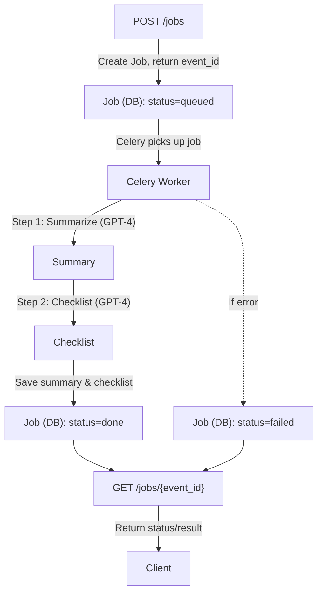

# Guideline API

A minimal backend API for processing clinical guidelines using GPT-4. Built with Django, Celery, and Redis for asynchronous job processing.

## Quick Start

```bash
docker compose up --build
```

The API will be available at `http://localhost:8000`

## API Endpoints

- **POST /jobs/** - Create a new guideline processing job
- **GET /jobs/{event_id}/** - Get job status and results
- **GET /api/docs/** - Interactive API documentation (Swagger UI)
- **GET /api/schema/** - OpenAPI specification

## Architecture & Design Choices



### **Asynchronous Processing**
- **Celery + Redis**: Chose for reliable job queuing and processing
- **Two-step GPT chain**: Summarize → Generate checklist for better results
- **Event-driven**: Returns event_id immediately (<200ms) while processing continues

### **Database Design**
- **PostgreSQL**: Robust, ACID-compliant for job persistence
- **UUID primary keys**: Globally unique, no sequential dependencies
- **Status tracking**: Clear state machine (queued → processing → done/failed)

### **Error Handling**
- **Retry logic**: Exponential backoff for transient failures
- **Graceful degradation**: Jobs marked as failed after max retries
- **Validation**: Required fields enforced at API level

### **Testing Strategy**
- **Comprehensive unit tests**: 22 tests covering models, views, tasks
- **Mocked external dependencies**: OpenAI API mocked for reliable testing
- **SQLite for tests**: Fast, isolated test database

## AI Tools Usage

### **Cursor AI Assistant**
- **Code generation**: Initial Django project structure and API views
- **Test writing**: Comprehensive test suite with proper mocking
- **Documentation**: OpenAPI schema generation and README
- **Refactoring**: Code cleanup and optimization

### **How AI Helped**
1. **Rapid prototyping**: Generated initial Django models and views in minutes
2. **Best practices**: Ensured proper error handling and validation
3. **Testing**: Created thorough test suite with edge cases
4. **Documentation**: Auto-generated OpenAPI spec with examples
5. **Code quality**: Identified and fixed potential issues

### **AI Limitations & Human Oversight**
- **Architecture decisions**: Human judgment on system design
- **Business logic**: Manual review of GPT prompt engineering
- **Security**: Manual validation of API key handling
- **Performance**: Human optimization of database queries

## Technical Stack

- **Backend**: Django 5.2 + Django REST Framework
- **Queue**: Celery + Redis
- **Database**: PostgreSQL
- **AI**: OpenAI GPT-4
- **Documentation**: drf-spectacular (OpenAPI)
- **Testing**: pytest + coverage
- **Deployment**: Docker + docker-compose

## Development

```bash
# Install dependencies
pip install -r requirements.txt
pip install -r requirements-test.txt

# Run tests
./run_tests.sh

# Run with coverage
./run_tests.sh --coverage
```

## Troubleshooting

### Common Issues

- **OpenAI API key not set**
  - Ensure you have set `OPENAI_API_KEY` in your `.env` file. The worker will fail if this is missing.
- **Database connection errors**
  - Make sure Postgres is running and the credentials in `.env` match your Docker Compose setup.
- **Redis connection errors**
  - Ensure Redis is running and the `REDIS_URL`/`CELERY_BROKER_URL` are correct.
- **Job stuck in queued**
  - Check that the Celery worker is running and connected to Redis.
- **API returns 400 with validation errors**
  - The API now returns DRF-style errors, e.g. `{ "guideline_text": ["This field is required."] }`.

## Environment Variables

The following environment variables are required (see `.env.example`):

- `SECRET_KEY` - Django secret key
- `DEBUG` - Set to `True` for development
- `DJANGO_ALLOWED_HOSTS` - Comma-separated list of allowed hosts
- `DATABASE_URL` - Postgres connection string
- `REDIS_URL` - Redis connection string
- `OPENAI_API_KEY` - Your OpenAI API key
- `CELERY_BROKER_URL` - Celery broker (should match Redis URL)
- `CELERY_RESULT_BACKEND` - Celery result backend (should match Redis URL)

Copy `.env.example` to `.env` and fill in your values before running the app.

## License

MIT License - see LICENSE file for details. 