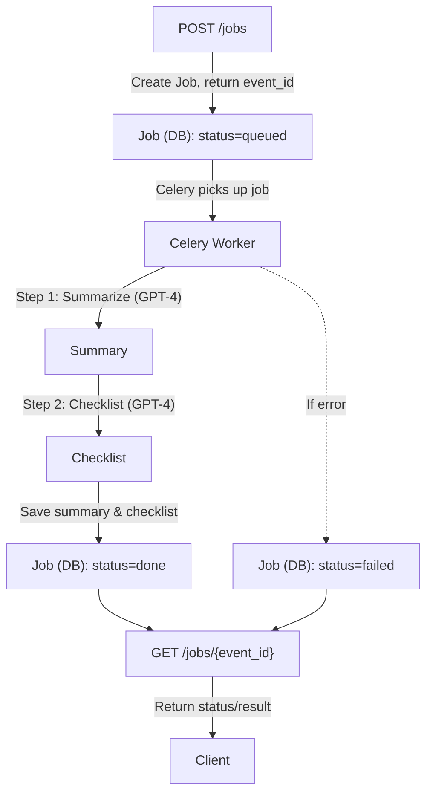

# Guideline API

A minimal backend API for processing clinical guidelines using GPT-4. Built with Django, Celery, and Redis for asynchronous job processing.

## Quick Start

```bash
docker compose up --build
```

The API will be available at `http://localhost:8000`

## Usage Examples

### Create a new job
```bash
curl -X POST http://localhost:8000/jobs/ \
  -H "Content-Type: application/json" \
  -d '{
    "title": "Diabetes Management Guidelines",
    "guideline_text": "Patients with diabetes should monitor blood glucose daily and take medications as prescribed. Regular checkups with healthcare providers are essential for managing the condition effectively."
  }'
```

### Check job status
```bash
curl http://localhost:8000/jobs/123e4567-e89b-12d3-a456-426614174000/
```

## Architecture & Design Choices



### **Asynchronous Processing**
- **Celery + Redis**: Reliable job queuing and processing
- **Two-step GPT chain**: Summarize → Generate checklist
- **Event-driven**: Returns event_id immediately (<200ms) while processing continues

### **Database Design**
- **PostgreSQL**: ACID-compliant for job persistence
- **UUID primary keys**: Globally unique, no sequential dependencies
- **Status tracking**: Clear state machine (queued → processing → done/failed)

### **Error Handling**
- **Retry logic**: Exponential backoff for transient failures
- **Graceful degradation**: Jobs marked as failed after max retries
- **Validation**: Required fields enforced at API level

## AI Tools Usage

**Cursor AI Assistant** helped with:
- Code generation for Django models, views, and tests
- Documentation and OpenAPI schema generation
- Code cleanup and best practices implementation
- Error handling and validation improvements

## Technical Stack

- **Backend**: Django 5.2 + Django REST Framework
- **Queue**: Celery + Redis
- **Database**: PostgreSQL
- **AI**: OpenAI GPT-4
- **Documentation**: drf-spectacular (OpenAPI)
- **Testing**: pytest + coverage
- **Deployment**: Docker + docker-compose

## Development

```bash
# Install dependencies
pip install -r requirements.txt
pip install -r requirements-test.txt

# Run tests
./run_tests.sh

# Run with coverage
./run_tests.sh --coverage
```

## Running Tests Locally

To run the test suite with the correct settings (using an in-memory SQLite database and test-specific configuration), use:

```sh
python manage.py test jobs.tests --settings=app.test_settings -v 2
```
y
This ensures:
- No need for Docker or a running PostgreSQL instance
- Tests run quickly and safely in isolation
- Celery and other production services are disabled for tests

**Note on test commands:**

- `./run_tests.sh`  
  - **Recommended for most use cases.**
  - Uses `pytest` for advanced features (e.g., coverage, parallelization, test selection).
  - Always uses the correct test settings (`app.test_settings`), so it’s safe and fast.
  - Supports extra options:
    - `--coverage` for coverage reports
    - `--unit` or `--integration` for test selection
    - `--parallel` for faster runs on multi-core machines

- `python manage.py test jobs.tests --settings=app.test_settings -v 2`  
  - Runs tests using Django’s built-in test runner.
  - Useful for debugging or if you need Django’s test output/behavior.
  - Does not support the extra options provided by the script.

## Troubleshooting

### Common Issues

- **OpenAI API key not set**
  - Ensure you have set `OPENAI_API_KEY` in your `.env` file. The worker will fail if this is missing.
- **Database connection errors**
  - Make sure Postgres is running and the credentials in `.env` match your Docker Compose setup.
- **Redis connection errors**
  - Ensure Redis is running and the `REDIS_URL`/`CELERY_BROKER_URL` are correct.
- **Job stuck in queued**
  - Check that the Celery worker is running and connected to Redis.
- **API returns 400 with validation errors**
  - The API now returns DRF-style errors, e.g. `{ "guideline_text": ["This field is required."] }`.

## Environment Variables

The following environment variables are required (see `.env.example`):

- `SECRET_KEY` - Django secret key
- `DEBUG` - Set to `True` for development
- `DJANGO_ALLOWED_HOSTS` - Comma-separated list of allowed hosts
- `DATABASE_URL` - Postgres connection string
- `REDIS_URL` - Redis connection string
- `OPENAI_API_KEY` - Your OpenAI API key
- `CELERY_BROKER_URL` - Celery broker (should match Redis URL)
- `CELERY_RESULT_BACKEND` - Celery result backend (should match Redis URL)

Copy `.env.example` to `.env` and fill in your values before running the app.

## License

MIT License - see LICENSE file for details. 